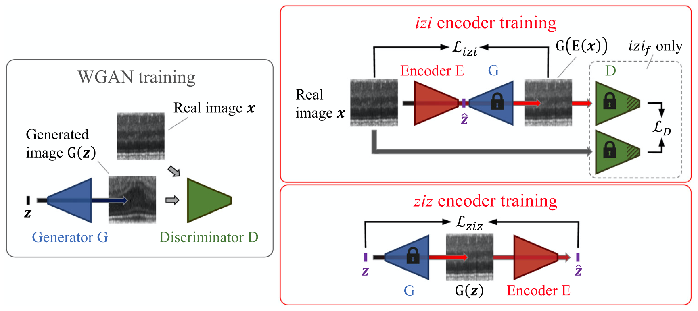
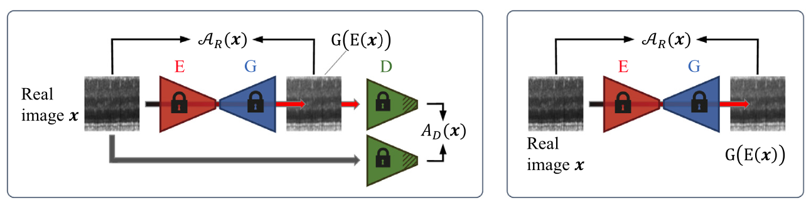
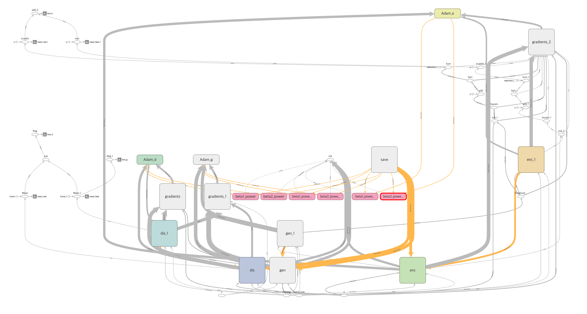

f-AnoGAN: Fast unsupervised anomaly detection with generative adversarial networks
=====

Example of Anomaly Detection using <a href="https://www.sciencedirect.com/science/article/abs/pii/S1361841518302640">f-AnoGAN</a>.

## Summary

### f-AnoGAN architecture  

    
  
The architecture of f-AnoGAN [1].

    
  
The logic for calculating anomaly score [1].

### Graph in TensorBoard

    
  
Graph of f-AnoGAN.

### Problem Definition

    
  
'Class-1' is defined as normal and the others are defined as abnormal.

## Results

## Environment
* Python 3.7.4  
* Tensorflow 1.14.0  
* Numpy 1.17.1  
* Matplotlib 3.1.1  
* Scikit Learn (sklearn) 0.21.3  

## Reference
[1] Schlegl, Thomas, et al (2019). <a href="https://www.sciencedirect.com/science/article/abs/pii/S1361841518302640">f-AnoGAN: Fast unsupervised anomaly detection with generative adversarial networks</a>. Medical image analysis 54 (2019): 30-44.
