f-AnoGAN: Fast unsupervised anomaly detection with generative adversarial networks
=====

TensorFlow implementation of <a href="https://www.sciencedirect.com/science/article/abs/pii/S1361841518302640">f-AnoGAN</a> with MNIST dataset [1].  
The base model <a href="https://github.com/YeongHyeon/WGAN-TF">WGAN</a> is also implemented with TensorFlow.   

## Summary

### f-AnoGAN architecture  

    
  
The architecture of f-AnoGAN [1].

    
  
The logic for calculating anomaly score [1].

### Graph in TensorBoard

    
  
Graph of f-AnoGAN.

### Problem Definition

  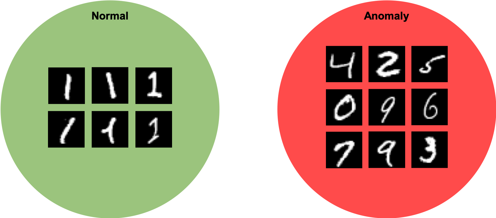  
  
'Class-1' is defined as normal and the others are defined as abnormal.

## Results

### Training Phase-1 (WGAN Training)

#### Training graph of Phase-1
The rear half of the graph represents the state of the training phase 2.  

|Term Real|Term Fake|
|:---:|:---:|
|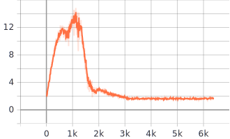|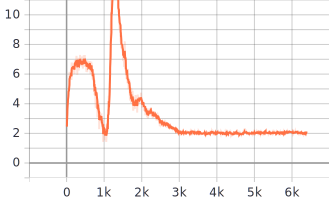|

|Loss D (Discriminator)|Loss G (Generator)|
|:---:|:---:|
|||

#### Result of Phase-1

|z:2|z:2 (latent space walking)|
|:---:|:---:|
|||

|z:64|z:128|
|:---:|:---:|
|||

### Training Phase-2 (izi Training)

#### Training graph of Phase-2
The front half of the graph represents the state of the training phase 1.  

|Term izi|Term ziz|Loss E (Encoder)|
|:---:|:---:|:---:|
|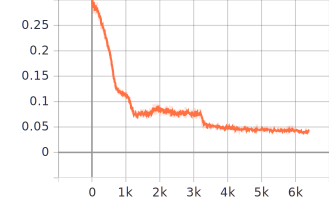|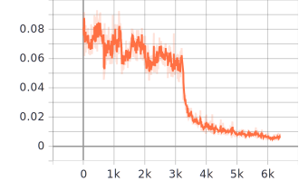|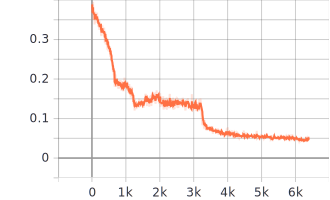|

#### Result of Phase-2

    
  
Restoration result by f-AnoGAN.

### Test Procedure

  
  
Box plot with encoding loss of test procedure.

  

    
    
    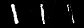
  

  
Normal samples classified as normal.

  

    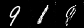
    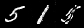
    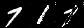
  

  
Abnormal samples classified as normal.

  

    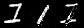
    
    
  

  
Normal samples classified as abnormal.

  

    
    
    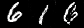
  

  
Abnormal samples classified as abnormal.

## Environment
* Python 3.7.4  
* Tensorflow 1.14.0  
* Numpy 1.17.1  
* Matplotlib 3.1.1  
* Scikit Learn (sklearn) 0.21.3  

## Reference
[1] Schlegl, Thomas, et al (2019). <a href="https://www.sciencedirect.com/science/article/abs/pii/S1361841518302640">f-AnoGAN: Fast unsupervised anomaly detection with generative adversarial networks</a>. Medical image analysis 54 (2019): 30-44.
